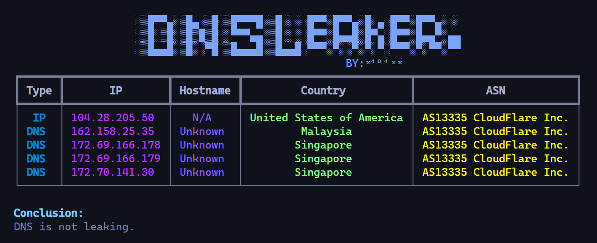

<div align="center">


**DNS-Leaker** is a tool for checking whether your DNS is leaking.



</div>

## **Installation**

**Using** _`poetry`_

```
git clone https://github.com/x404xx/DNS-Leaker.git
cd DNS-Leaker
poetry shell
poetry install
```

**Using** _`pip`_

```
git clone https://github.com/x404xx/DNS-Leaker.git
cd DNS-Leaker
virtualenv env
env/scripts/activate
pip install -r requirements.txt
```

## Usage Example

```bash
python -m dnsleaker
```


## **Legal Disclaimer**

> [!Note]
> This was made for educational purposes only, nobody which directly involved in this project is responsible for any damages caused. **_You are responsible for your actions._**
